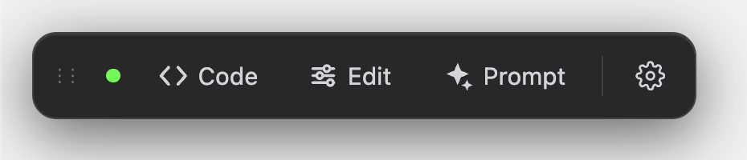
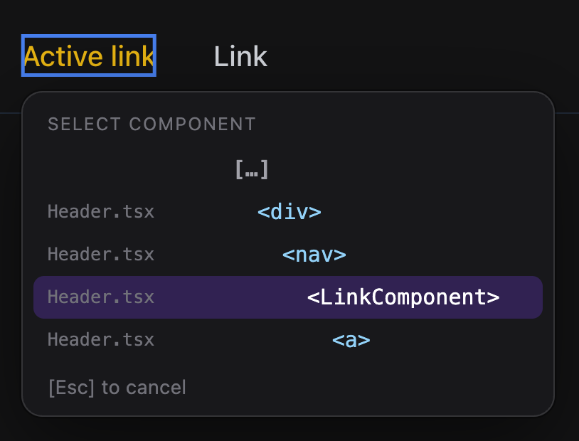
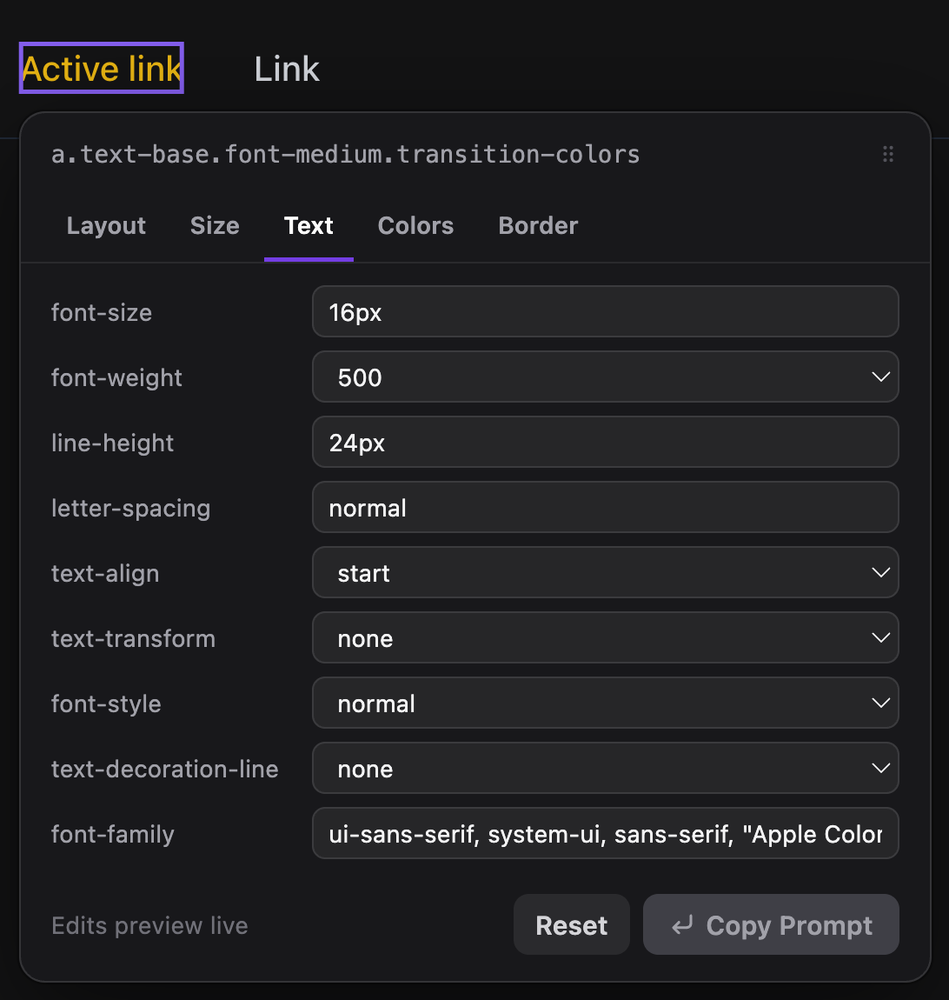
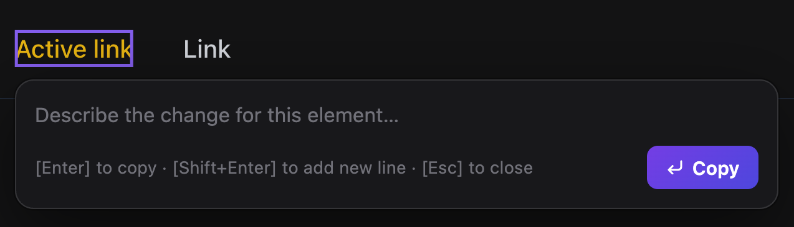
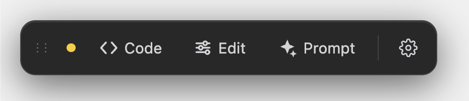

# @fredsvanelli/frontpeek

A floating dev toolbar for React / Next.js apps. Click any element in your running app to jump to its source, tweak its styles, or turn it into an AI prompt.



Three tools, one click away:

- **Code:** jump to the element's source file. If the [FrontPeek VS Code extension](https://marketplace.visualstudio.com/items?itemName=fredsvanelli.frontpeek) is running, it opens the exact file/line in your editor. If not, the component path is copied to your clipboard.
- **Edit:** tweak an element's styles in a live editor and copy the change as a ready-to-paste AI prompt.
- **Prompt:** click an element, describe a change, and copy a structured prompt that already points at the right file and JSX.

### Pick the exact element you meant

A click rarely has just one valid target. The element sits inside a whole component hierarchy (`Routes > Page > List > p`), and your intent may live at any level of it. So after you click, all three tools open a small picker listing the deepest levels of that hierarchy; choose the one you meant and it is resolved. Click `[…]` at the top to reveal more ancestors, hover a row to highlight what it covers on the page.



### Edit styles live, copy the diff as a prompt

The **Edit** tool opens an inspector grouped into Layout, Size, Text, Colors, and Border tabs. Changes preview live on the page; hit **Copy Prompt** to grab the change as text you can paste into any AI assistant.



### Describe a change in plain words

The **Prompt** tool skips the styling UI entirely: click an element, describe the change you want, and copy a structured prompt that already points at the right file and JSX.



The toolbar is **self-contained**, it needs no browser extension and no proxy. Source resolution runs in the browser against your own dev server, so it works at your app's real origin.

## Install

```bash
npm install @fredsvanelli/frontpeek
```

`react` (>=17) is a peer dependency.

## Usage

Drop `<FrontPeek />` once, near the root of your app.

### Next.js (App Router) — `app/layout.tsx`

```tsx
import { FrontPeek } from '@fredsvanelli/frontpeek';

export default function RootLayout({ children }) {
  return (
    <html>
      <body>
        {children}
        <FrontPeek />
      </body>
    </html>
  );
}
```

### React (Vite / CRA)

```jsx
import { FrontPeek } from '@fredsvanelli/frontpeek';

function App() {
  return (
    <>
      {/* your app */}
      <FrontPeek />
    </>
  );
}
```

## Choosing where it shows

By default FrontPeek renders **only in local development** (`process.env.NODE_ENV === 'development'`).

To control it explicitly, pass the `enabled` boolean — you decide the condition, so any environment scheme works (Vercel, custom `NEXT_PUBLIC_*` vars, staging/preview, custom strings like `prod` / `stg`):

```tsx
// show everywhere except production
<FrontPeek enabled={process.env.NEXT_PUBLIC_APP_ENV !== 'production'} />

// show on an explicit allow-list of environments
<FrontPeek enabled={['development', 'staging', 'prod'].includes(process.env.NEXT_PUBLIC_APP_ENV)} />

// force off
<FrontPeek enabled={false} />
```

> Environment variables are inlined at build time, so gate on ones your bundler exposes to the browser (e.g. `NEXT_PUBLIC_*` in Next).

## Props

| Prop         | Type      | Default                                  | Description                                                        |
| ------------ | --------- | ---------------------------------------- | ------------------------------------------------------------------ |
| `enabled`    | `boolean` | `NODE_ENV === 'development'` when omitted | Whether the toolbar mounts. Explicit boolean always wins.          |
| `bridgePort` | `number`  | `57420`                                  | Loopback port the VS Code extension listens on. Change only if you customized the extension. |

## Open-in-editor (optional, but very recommended!)

Clicking **Code** copies the path by default. To have it **open your editor** instead, install the companion [FrontPeek VS Code extension](https://marketplace.visualstudio.com/items?itemName=fredsvanelli.frontpeek). It runs a tiny local bridge on `localhost:57420`; when detected, the toolbar's status dot turns green and **Code** opens the file at the exact line. Nothing else about the toolbar changes.

The status dot tells you which mode you're in, amber when the toolbar is on its own (clipboard), green when the extension is connected (open-in-editor):

| Standalone (clipboard) | Extension connected (open-in-editor) |
| ---------------------- | ------------------------------------ |
|  |  |

## License

MIT
